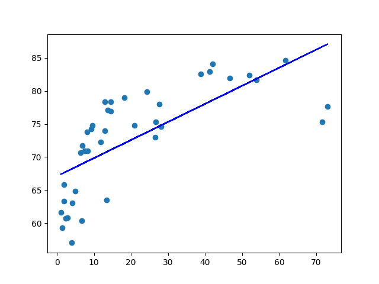

# Author: Yryskeldi Emilbek uulu

This project examines the impact of per capita GDP on life expectancy at birth using a sample of 40 countries for 2017. I argue that per capita GDP has a positive impact on life expectancy. Reflected in increases of per capita GDP, economic growth leads to changes in nation-wide nutrition patterns and healthcare access. Studies also suggest evidence that increases in per capita GDP lead to more time spent for leisure; this improvement also enhances quality of life and, consequently, life expectancy.

I obtained my data from the World Bank’s database. The data consists of a random sample of 40 countries. Two variables for each country include their per capita GDP (measured in current international dollars) and life expectancy (measured in total years) in 2017. 

In order to test my hypothesis that per capita GDP has a positive impact on life expectancy, I estimate a simple linear regression model using the numpy, matplotlib, and sklearn Python libraries. The X-axis reflects the values for GDP per capita and the Y-axis reflects the values for life expectancy:

The estimated relationship:

Life expectancy = 67.112+0.273×GDP

Acknowledgments:
https://www.youtube.com/watch?v=_kb2X85DkKk&ab_channel=KindsonTheTechPro
